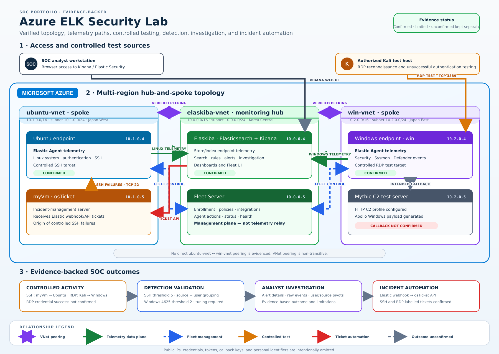

Azure ELK Security Lab

A hands-on Security Operations Center (SOC) lab built in Microsoft Azure using the Elastic Stack, Windows Sysmon and Defender telemetry, Ubuntu authentication logs, attack simulation, detection engineering, incident investigation, security dashboards, and automated incident ticketing.

Project Overview

This project demonstrates an end-to-end SOC monitoring and investigation workflow:

Attack Simulation → Telemetry Collection → Detection → Alert Triage → Investigation → Incident Ticketing → Security Monitoring

The lab was built to develop practical SOC analyst skills, including:

- Collecting and analyzing Windows and Linux security telemetry
- Monitoring authentication activity
- Investigating RDP and SSH brute-force activity
- Creating and validating security detection rules
- Analyzing endpoint process and security events
- Investigating alerts using Elastic
- Correlating security events during incident investigations
- Generating incidents through automated ticketing
- Building SOC dashboards for security monitoring
- Documenting investigation evidence and findings

## Architecture

- "## Project Sections

- [Lab Environment](environment/)
- [Telemetry Collection](telemetry/)
- [Attack Simulation](attack-simulation/)
- [Detection Engineering](detections/)
- [Investigations](investigations/)
- [Incident Automation](automation/)
- [SOC Dashboards](dashboards/)
- [Evidence](evidence/)

SOC Workflow

Attack Simulation
       ↓
Endpoint / Network Activity
       ↓
Telemetry Collection
       ↓
Elastic
       ↓
Detection Rules
       ↓
Security Alert
       ↓
Alert Triage
       ↓
Investigation
       ↓
Incident Ticket
       ↓
Dashboard / Reporting

SOC Use Cases

Windows Security Monitoring

- Windows authentication activity
- RDP activity
- Sysmon process telemetry
- Windows Defender events
- Endpoint process investigation

Linux Security Monitoring

- SSH authentication activity
- Failed login detection
- Successful login analysis
- Authentication anomaly investigation

Detection Engineering

- Brute-force detection
- Suspicious authentication detection
- Endpoint process detections
- Detection rule validation
- Alert tuning and investigation

Incident Investigation

- Alert triage
- Event correlation
- Timeline analysis
- Evidence collection
- Attack-source analysis
- Affected-host identification
- Investigation documentation

Incident Automation

- Automated incident creation
- Alert-to-ticket workflow
- Investigation evidence tracking
- Incident documentation

SOC Dashboards

- Security event monitoring
- Authentication activity
- Endpoint telemetry
- Detection alerts
- Investigation visibility

Project Objective

The objective of this lab is to demonstrate the practical workflow of a SOC analyst—from generating suspicious activity and collecting telemetry to detecting, investigating, documenting, and escalating a security incident.

The project focuses on turning raw security telemetry into actionable alerts, investigation evidence, and documented incidents.
