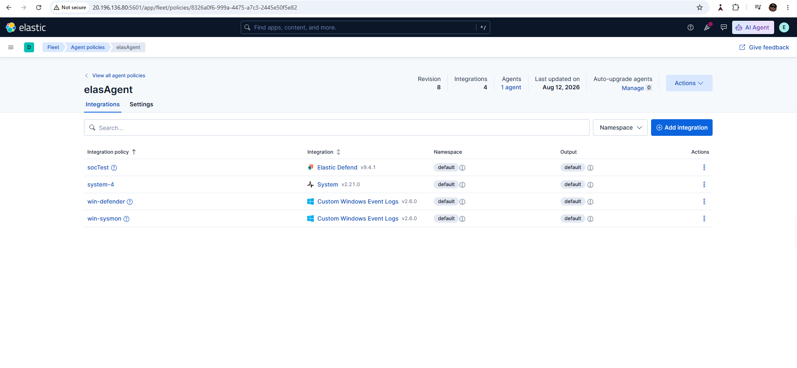
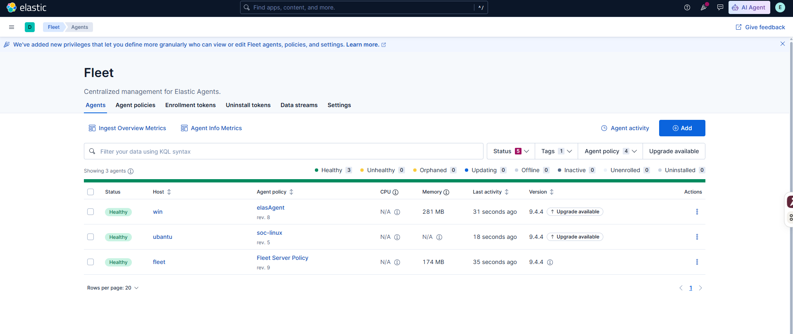
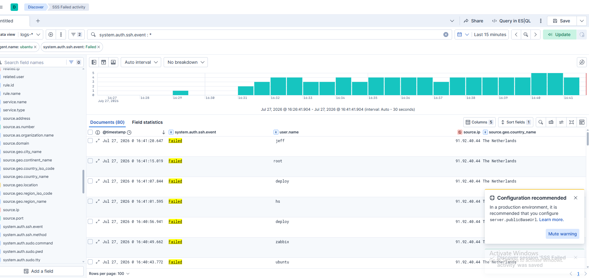
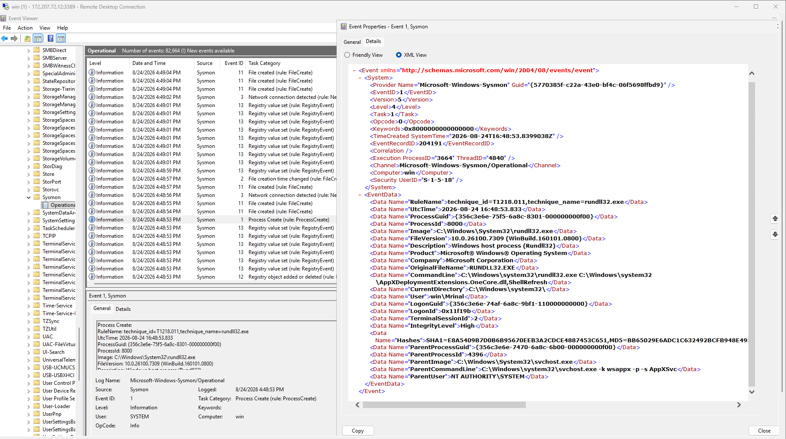
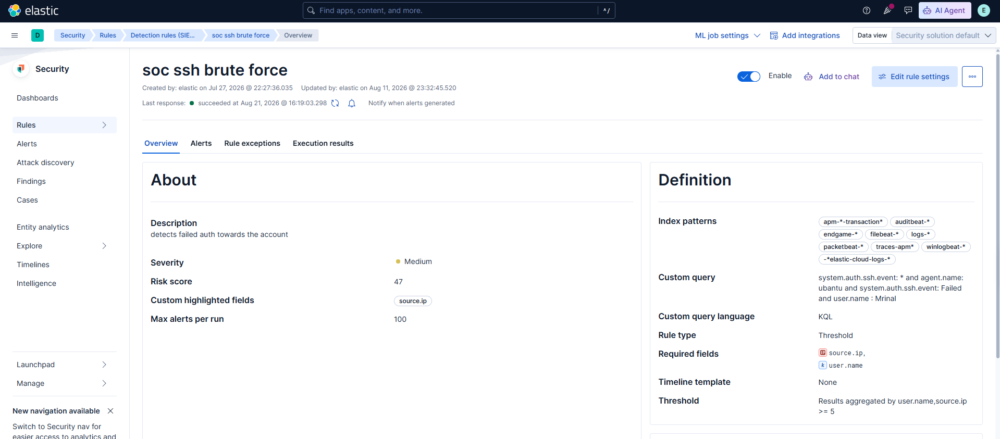
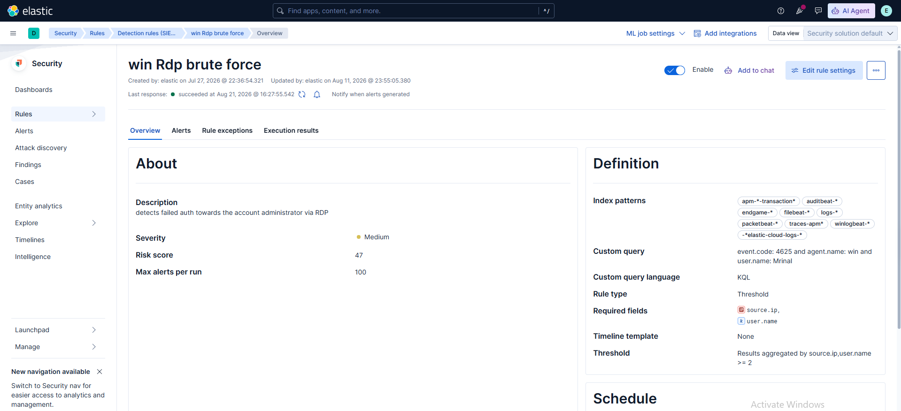
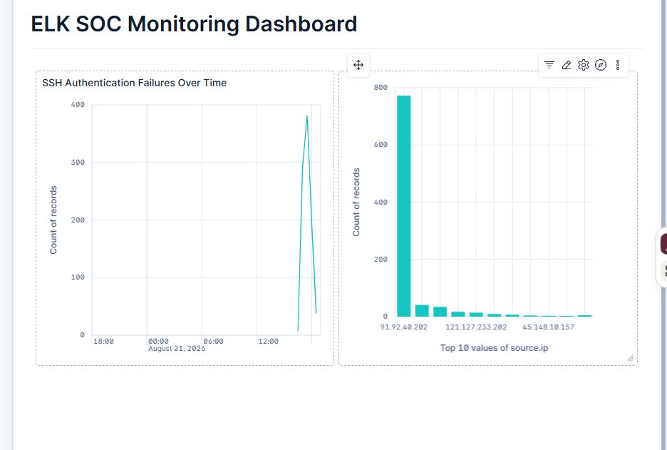

# Azure ELK SOC

## Security Monitoring, Detection, Investigation & Incident Response Report

**Project:** Azure ELK Security Lab  
**Environment:** Microsoft Azure  
**SIEM:** Elastic Stack / Kibana  
**Monitored endpoints:** Windows and Ubuntu  
**Incident management:** osTicket  
**Report date:** August 2026

> This report documents a controlled security-learning environment. All attack activity was intentionally generated inside the lab. No production systems, external users, or third-party systems were targeted.

## Table of Contents

- [1. Executive Summary](#1-executive-summary)
- [2. Scope and Objectives](#2-scope-and-objectives)
- [3. Lab Architecture](#3-lab-architecture)
- [4. Log Sources and Telemetry](#4-log-sources-and-telemetry)
- [5. Attack Simulation](#5-attack-simulation)
- [6. Detection Engineering](#6-detection-engineering)
- [7. Investigation Methodology](#7-investigation-methodology)
- [8. Investigation Case 1 — Ubuntu SSH Brute Force](#8-investigation-case-1--ubuntu-ssh-brute-force)
- [9. Investigation Case 2 — Windows RDP Brute Force](#9-investigation-case-2--windows-rdp-brute-force)
- [10. Alert Triage and Correlation](#10-alert-triage-and-correlation)
- [11. Automated osTicket Incident Creation](#11-automated-osticket-incident-creation)
- [12. SOC Dashboard and Monitoring](#12-soc-dashboard-and-monitoring)
- [13. Detection Tuning](#13-detection-tuning)
- [14. Key Findings](#14-key-findings)
- [15. Limitations](#15-limitations)
- [16. Recommendations](#16-recommendations)
- [17. Lessons Learned](#17-lessons-learned)
- [18. Conclusion](#18-conclusion)
- [19. Evidence Appendix](#19-evidence-appendix)

---

## 1. Executive Summary

This project demonstrates a practical Security Operations Center (SOC) environment built in Microsoft Azure using the Elastic Stack. The lab contained six virtual machines supporting Elasticsearch and Kibana, Fleet Server, Windows and Ubuntu log sources, osTicket incident management, and Mythic C2 testing. Azure VNet peering enabled communication between systems deployed across separate virtual networks and regions.

The Windows and Ubuntu virtual machines were the primary security telemetry sources. Elastic Agent was installed on both endpoints and managed through Fleet Server. The Windows endpoint provided Windows authentication, Sysmon, Microsoft Defender, and RDP-related events. The Ubuntu endpoint provided Linux system and SSH authentication logs. This telemetry was centralized in Elasticsearch and analyzed through Kibana and Elastic Security.

A Kali Linux system was used to generate controlled failed-login activity. SSH authentication attempts targeted the Ubuntu VM, while RDP reconnaissance and authentication testing targeted the Windows VM. Threshold-based Elastic Security rules identified repeated failed-login activity and generated alerts.

The related alerts were investigated by reviewing source IP addresses, usernames, affected hosts, authentication outcomes, event counts, timestamps, and surrounding activity. Elastic was also integrated with osTicket through a webhook/API workflow so that detections could generate incident tickets automatically. Kibana dashboards were created to summarize authentication failures and high-volume source addresses.

The lab additionally included Mythic and Apollo configuration for controlled C2 testing. The evidence confirms C2 profile configuration and payload creation, but it does **not** conclusively demonstrate a successful active callback. Likewise, the RDP brute-force test did **not** identify valid credentials or establish authenticated access.

### SOC Workflow

```text
Controlled Attack Simulation
        ↓
Windows and Ubuntu Telemetry
        ↓
Elastic Agent (managed by Fleet Server)
        ↓
Elasticsearch
        ↓
Elastic Security Detection Rules
        ↓
Security Alerts
        ↓
Investigation and Correlation
        ↓
Automatic osTicket Incident
        ↓
Kibana Dashboard and Detection Tuning
```

---

## 2. Scope and Objectives

### 2.1 Scope

The project scope was to build a cloud-based SOC learning environment in Microsoft Azure using:

- Elasticsearch and Kibana
- Elastic Fleet Server
- A Windows monitored endpoint
- An Ubuntu monitored endpoint
- An osTicket incident-management server
- A Mythic C2 server

The Windows endpoint generated Windows security, authentication, Sysmon, Defender, and RDP-related telemetry. The Ubuntu endpoint generated Linux system and SSH authentication logs. Elastic Agent collected endpoint data, Fleet Server managed the agents and policies, Elasticsearch stored and indexed the telemetry, and Kibana and Elastic Security supported searching, detection, alerting, investigation, and visualization.

The scope also included controlled SSH and RDP authentication testing, custom detection rules, alert investigation, osTicket automation, Kibana dashboards, and Mythic/Apollo configuration and testing.

### 2.2 Objectives

The main objectives were to:

- Learn how Windows and Linux security logs are generated and collected.
- Configure and manage Elastic Agent through Fleet Server.
- Centralize Windows and Ubuntu telemetry in Elasticsearch.
- Use KQL to search, filter, and investigate raw security events.
- Generate controlled SSH and RDP failed-login activity.
- Create and validate threshold-based authentication detections.
- Investigate alerts using source, user, host, timestamp, outcome, and event-count context.
- Distinguish an attempted attack from confirmed successful access.
- Automate osTicket incident creation from Elastic alerts.
- Build Kibana visualizations for high-volume security data.
- Practice the complete workflow from telemetry generation to detection, investigation, ticketing, monitoring, and tuning.

### 2.3 Scope Boundaries

This was a controlled learning environment and was not connected to a production network. No real business users or systems were monitored. The lab did not provide continuous 24/7 monitoring or analyst coverage.

All SSH, RDP, and Mythic activity was intentionally generated for defensive testing. Detection of an attempt is not treated as proof of compromise unless the authentication and endpoint evidence supports that conclusion.

---

## 3. Lab Architecture

The SOC lab used six Azure virtual machines distributed across Korea Central, Japan West, and Japan East. Regional vCPU quota limitations prevented all required systems from being deployed in one region, so the design used three virtual networks connected through VNet peering.

### 3.1 Virtual Machine Roles

| System | Private IP | Region | Role |
| --- | --- | --- | --- |
| Elaskiba VM | `10.0.0.4` | Korea Central | Elasticsearch and Kibana; telemetry storage, search, detection, investigation, and dashboards |
| Fleet Server VM | `10.0.0.5` | Korea Central | Elastic Agent enrollment, policy management, integrations, and health visibility |
| Ubuntu VM | `10.1.0.4` | Japan West | Linux system and SSH authentication telemetry source |
| MyVm | `10.1.0.5` | Japan West | osTicket incident-management server |
| Windows VM | `10.2.0.4` | Japan East | Windows authentication, Sysmon, Defender, and RDP telemetry source |
| Mythic VM | `10.2.0.5` | Japan East | Mythic HTTP C2 profile and Apollo payload testing |

Fleet Server managed agents and their policies; it was not the primary log-analysis platform. Elastic Agents collected endpoint telemetry, Elasticsearch stored and indexed it, and Kibana and Elastic Security were used for investigation.

### 3.2 Azure Virtual Network Design

| Virtual network | Address space | Subnet | Region | Systems |
| --- | --- | --- | --- | --- |
| `elaskiba-vnet` | `10.0.0.0/16` | `10.0.0.0/24` | Korea Central | Elaskiba VM, Fleet Server VM |
| `ubuntu-vnet` | `10.1.0.0/16` | `10.1.0.0/24` | Japan West | Ubuntu VM, MyVm/osTicket |
| `win-vnet` | `10.2.0.0/16` | `10.2.0.0/24` | Japan East | Windows VM, Mythic VM |

### 3.3 VNet Peering

The following peering relationships were configured:

- `elaskiba-vnet ↔ ubuntu-vnet`
- `elaskiba-vnet ↔ win-vnet`

There was no direct peering between `ubuntu-vnet` and `win-vnet`. The `elaskiba-vnet` acted as the central monitoring network because it contained Elasticsearch, Kibana, and Fleet Server infrastructure.


*Figure 1 — Azure VNet peering from `elaskiba-vnet` to the Ubuntu and Windows virtual networks, showing both peerings in a connected and synchronized state.*

[View full-size evidence](evidence/azure/azure-vnet-peerings.png)

### 3.4 System Communication Flow

```text
Ubuntu VM
  └─ Elastic Agent ── Linux system and SSH telemetry ──┐
                                                       │
Windows VM                                             ├─→ Elasticsearch
  └─ Elastic Agent ── Windows, Sysmon, Defender, RDP ──┘       ↓
                                                         Kibana / Elastic Security
                                                               ↓
                                              Detection → Alert → Investigation
                                                               ↓
                                                Webhook → osTicket Incident

Fleet Server ── manages endpoint agents, policies, and integrations
Mythic VM ── HTTP C2 profile and Apollo payload testing against Windows VM
```

### 3.5 Architecture Summary

The final design provided a centralized, multi-platform SOC learning environment. Windows and Ubuntu operated as separate telemetry sources; Fleet Server managed the agents; Elasticsearch stored and indexed their data; and Kibana and Elastic Security supported search, detection, investigation, and visualization. osTicket provided incident tracking, while Mythic provided a controlled adversary-simulation component.

---

## 4. Log Sources and Telemetry

Elastic Agent was installed on the Windows and Ubuntu endpoints. Fleet Server managed agent enrollment, policies, and integrations. Collected security data was stored in Elasticsearch and reviewed through Kibana and Elastic Security.

### 4.1 Windows Telemetry

The Windows monitoring configuration included:

- Windows Event Logs
- Windows authentication events
- Sysmon telemetry
- Microsoft Defender events
- RDP-related authentication activity

Sysmon added detailed endpoint visibility, including process-creation data. Fleet policies and Windows integrations were configured so that Elastic Agent could forward the relevant events for monitoring and investigation.



*Figure 2 — Windows telemetry integrations and policies configured through Elastic Fleet, including the Windows Defender and Sysmon integrations.*

[View full-size evidence](evidence/telemetry/windows-telemetry-integrations.png)

### 4.2 Ubuntu Telemetry

The Ubuntu system provided:

- Linux system logs
- Authentication logs
- SSH authentication events
- Failed SSH login activity
- Authentication-outcome fields for failed and accepted events

The SSH telemetry supported failed-login monitoring, detection validation, and analyst investigation.



*Figure 3 — The Windows, Ubuntu, and Fleet Elastic Agents enrolled and reporting a healthy status in Fleet.*

[View full-size evidence](evidence/telemetry/fleet-agents.png)

### 4.3 Reviewing Raw Logs in Kibana Discover

Kibana Discover was used to review raw events and examine fields such as timestamp, username, source IP address, authentication result, host information, and related activity.



*Figure 4 — Failed Ubuntu SSH authentication events collected by Elastic Agent and reviewed in Kibana Discover.*

[View full-size evidence](evidence/telemetry/ubuntu-ssh-events.png)

Windows security events were also reviewed in Kibana, including authentication, Sysmon, and Defender-related telemetry.



*Figure 5 — A Sysmon Event ID 1 process-creation event collected from the Windows endpoint.*

[View full-size evidence](evidence/telemetry/sysmon-process-create.png)

### 4.4 Telemetry Collection Flow

```text
Ubuntu activity → Elastic Agent ─┐
                                 ├→ Elasticsearch → Kibana / Elastic Security
Windows activity → Elastic Agent ┘                     ↓
                                           Search, Detection, Investigation

Fleet Server → Agent enrollment, health, policies, and integrations
```

### 4.5 Telemetry Summary

Centralizing Windows and Ubuntu telemetry in Elastic made it possible to search large event volumes, validate detections, investigate suspicious activity, and create dashboards from a single SOC platform.

---

## 5. Attack Simulation

Controlled security activity was generated only inside the lab. The primary scenarios were:

- SSH failed-login testing against the Ubuntu VM
- RDP reconnaissance and failed-login testing against the Windows VM
- Mythic HTTP C2 and Apollo payload testing for the Windows environment

### 5.1 SSH Failed-Login Testing

Repeated SSH authentication failures were intentionally generated against the Ubuntu VM so that Elastic Agent could collect the events and the SSH threshold detection could be validated.


*Figure 6 — Controlled SSH failed-authentication events filtered by lab username, source, and failed outcome in Kibana Discover.*

[View full-size evidence](evidence/investigations/ssh-failed-auth-analysis.png)

### 5.2 RDP Reconnaissance

Before authentication testing, reconnaissance confirmed that TCP port `3389` was open and that the Windows Remote Desktop service was reachable.

```text
3389/tcp open  ms-wbt-server
```


*Figure 7 — RDP reconnaissance confirming TCP port 3389 open on the Windows VM.*

[View full-size evidence](evidence/attack-simulation/rdp-reconnaissance.png)

### 5.3 RDP Brute-Force Testing

Crowbar was used to generate repeated RDP authentication attempts. The test did not identify valid credentials and did not establish authenticated RDP access. It is therefore documented as a controlled brute-force **attempt**, not a successful compromise.


*Figure 8 — Controlled Crowbar RDP brute-force testing against the Windows VM; the captured result shows no valid credential was found.*

[View full-size evidence](evidence/attack-simulation/rdp-bruteforce-attempt.png)

### 5.4 Mythic C2 Testing

An HTTP C2 profile was configured in Mythic and an Apollo payload was generated for Windows. Testing covered profile configuration, payload creation, callback parameters, network connectivity, and troubleshooting.

The supplied evidence does not conclusively demonstrate a successful active Mythic callback. The component is therefore documented as C2 configuration and controlled testing rather than successful endpoint compromise.


*Figure 9 — Mythic HTTP C2 profile configured for controlled Apollo payload testing.*

[View the C2 profile](evidence/attack-simulation/mythic-c2-profile.png) · [View Apollo payload creation](evidence/attack-simulation/mythic-payload-creation.png)

### 5.5 Attack-Simulation Summary

The simulations generated realistic defensive telemetry without requiring a successful compromise:

```text
Attack Activity → Security Telemetry → Elastic Collection
        → Detection → Alert → Investigation
```

---

## 6. Detection Engineering

Custom threshold-based Elastic Security rules were used to identify repeated SSH and RDP authentication failures.

### 6.1 SSH Brute-Force Detection

| Field | Value |
| --- | --- |
| Rule name | `SOC ssh brute force` |
| Platform | Ubuntu / Linux |
| Data source | SSH authentication telemetry |
| Threshold | Five or more matching failed SSH authentication events |
| Purpose | Identify repeated failed SSH authentication attempts |

Repeated controlled failures reached the configured detection condition and generated an alert. The execution history confirms that the enabled rule ran successfully and processed the available telemetry.



*Figure 10 — Elastic Security definition for the `SOC ssh brute force` rule, configured to alert on five or more matching failed SSH authentication events.*

[View full-size evidence](evidence/detections/ssh-rule-definition.png)


*Figure 11 — Successful scheduled execution history for the enabled `SOC ssh brute force` detection rule.*

[View full-size evidence](evidence/detections/ssh-rule-execution.png)

### 6.2 RDP Brute-Force Detection

| Field | Value |
| --- | --- |
| Rule name | `win Rdp brute force` |
| Platform | Windows |
| Data source | Windows authentication / RDP-related telemetry |
| Event filter | Windows Event ID `4625` (failed logon) |
| Threshold | Two or more matching failed-authentication events |
| Grouping | Source IP and username |
| Purpose | Identify repeated failed RDP authentication attempts |

The rule identified the controlled RDP authentication activity. One Elastic alert snapshot showed **444 medium-severity alerts**, including **440 alerts** attributed to `win Rdp brute force`. This confirmed detection coverage but also exposed a need for tuning.



*Figure 12 — Elastic Security definition for the `win Rdp brute force` rule, matching Windows Event ID `4625` and alerting on two or more failed-authentication events grouped by source IP and username.*

[View full-size evidence](evidence/detections/rdp-rule-definition.png)


*Figure 13 — Successful scheduled execution history for the enabled `win Rdp brute force` detection rule.*

[View full-size evidence](evidence/detections/rdp-rule-execution.png)

### 6.3 Detection Validation

The SSH and RDP testing demonstrated that:

- Endpoint telemetry was reaching Elasticsearch.
- Detection rules were processing the relevant authentication events.
- Repeated failed-login activity could generate Elastic Security alerts.
- Analysts could pivot from the alert into supporting raw telemetry.
- Successful detection does not necessarily mean the rule is well tuned.

### 6.4 MITRE ATT&CK Mapping

| Scenario | Technique | Mapping rationale |
| --- | --- | --- |
| SSH password guessing | [T1110.001 — Brute Force: Password Guessing](https://attack.mitre.org/techniques/T1110/001/) | Repeated SSH authentication attempts represented password-guessing behavior. |
| SSH remote service | [T1021.004 — Remote Services: SSH](https://attack.mitre.org/techniques/T1021/004/) | SSH was the remote service used during Ubuntu testing. |
| RDP password guessing | [T1110.001 — Brute Force: Password Guessing](https://attack.mitre.org/techniques/T1110/001/) | Repeated authentication attempts targeted the Windows RDP service. |
| RDP remote service | [T1021.001 — Remote Services: RDP](https://attack.mitre.org/techniques/T1021/001/) | RDP was the remote-access service used during Windows testing. |

These mappings describe the simulated behavior and do not imply that successful access occurred.

---

## 7. Investigation Methodology

Alerts were not evaluated from the rule name or severity alone. The investigation process examined the supporting telemetry and distinguished direct observations from analysis and final conclusions.

### 7.1 Investigation Process

```text
Security Alert
      ↓
Rule, Timestamp, Severity, and Risk Score
      ↓
Source, User, Host, and Authentication Outcome
      ↓
Threshold / Event Count and Related Raw Events
      ↓
Activity Before and After the Alert
      ↓
Incident Assessment, Ticket Review, and Disposition
```

### 7.2 Fields Reviewed

- Alert and event timestamps
- Detection-rule name
- Alert status, severity, and risk score
- Source IP address
- Username
- Host information, when available
- Authentication result
- Threshold or event count
- Related authentication and endpoint events
- Surrounding activity before and after the alert

### 7.3 Investigation Principle

| Stage | Question |
| --- | --- |
| Observation | What does the evidence directly show? |
| Analysis | What security behavior does the observed event represent? |
| Conclusion | What outcome can be confirmed from the available evidence? |

Repeated failed authentication attempts do not automatically prove that an account was compromised. Successful access should be claimed only when correlated logs and endpoint evidence support it.

---

## 8. Investigation Case 1 — Ubuntu SSH Brute Force

### 8.1 Incident Overview

| Field | Value |
| --- | --- |
| Affected system | Ubuntu VM |
| Private IP | `10.1.0.4` |
| Detection rule | `SOC ssh brute force` |
| Activity | Repeated SSH authentication failures |
| Environment | Controlled lab simulation |

### 8.2 Alert Generation

Controlled SSH failures were collected by Elastic Agent and forwarded to Elasticsearch. The `SOC ssh brute force` rule processed the authentication events and generated a security alert after its configured condition was met.


*Figure 14 — Medium-severity SSH brute-force alert generated by `SOC ssh brute force` in Elastic Security.*

[View full-size evidence](evidence/detections/ssh-alert.png)

### 8.3 Alert Triage

One captured SSH alert showed:

| Field | Observed value |
| --- | --- |
| Severity | Medium |
| Risk score | 47 |
| Status | Open |
| Threshold result count | 6 |

The alert also exposed source and username context for further investigation. Source attribution was not assumed from the alert alone; the source IP, username, timestamp, and related raw events were correlated before connecting activity to a test system.

### 8.4 Raw Event Investigation

Kibana Discover was used to examine failed and accepted SSH authentication outcomes, usernames, source information, timestamps, and related activity.

An accepted authentication event by itself was not treated as proof that the simulated brute-force sequence succeeded. Username, source, and timestamp correlation is required before associating an accepted event with a specific attack sequence.


*Figure 15 — Detailed SSH authentication event reviewed in Kibana, including source, user, process, geographic enrichment, and authentication-result context.*

[View full-size evidence](evidence/investigations/ssh-event-detail.png)

### 8.5 Incident Timeline

The evidence-supported sequence was:

1. Controlled SSH authentication testing was initiated.
2. Repeated failures were recorded on the Ubuntu endpoint.
3. Elastic Agent forwarded the authentication telemetry.
4. `SOC ssh brute force` generated an alert.
5. Alert fields and related raw events were investigated.
6. An osTicket incident was generated and reviewed.
7. The controlled test was documented and the incident workflow completed.

Exact timestamps should be transcribed from the source systems without silently normalizing time zones.

### 8.6 Analyst Assessment

The repeated SSH failures were consistent with controlled failed-login activity generated inside the lab. Elastic collected the telemetry, the detection generated an alert, and the analyst workflow successfully moved from alert triage to raw-event review.

### 8.7 Incident Disposition

| Field | Disposition |
| --- | --- |
| Classification | Controlled SSH brute-force / failed-authentication simulation |
| Detection status | Successfully detected |
| Investigation status | Reviewed |
| Escalation | Incident ticket generated in osTicket |
| Final outcome | Detection and investigation workflow validated |

---

## 9. Investigation Case 2 — Windows RDP Brute Force

### 9.1 Incident Overview

| Field | Value |
| --- | --- |
| Affected system | Windows VM |
| Private IP | `10.2.0.4` |
| Detection rule | `win Rdp brute force` |
| Activity | Repeated RDP authentication attempts |
| Environment | Controlled lab simulation |

### 9.2 Reconnaissance

Nmap confirmed that the Windows Remote Desktop service was reachable on TCP port `3389` before authentication testing began.

### 9.3 Brute-Force Attempt

Crowbar generated RDP authentication attempts, but the captured result showed that no valid credential was found. The activity did not establish authenticated RDP access.

### 9.4 Alert Generation

The `win Rdp brute force` rule identified the generated activity. An expanded alert showed:

| Field | Observed value |
| --- | --- |
| Severity | Medium |
| Risk score | 47 |
| Status | Open |


*Figure 16 — Open, medium-severity Windows RDP brute-force alert with risk score 47 in Elastic Security.*

[View full-size evidence](evidence/detections/rdp-alert-details.png)

### 9.5 Investigation

The investigation reviewed the alert timestamp, rule, severity, risk score, username, source information, affected system where present, related authentication activity, and overall alert volume.

External IP-reputation or geographic data, if reviewed, was treated as supporting enrichment rather than definitive proof of identity or malicious intent.

### 9.6 Incident Timeline

The evidence-supported sequence was:

1. RDP service reconnaissance was performed.
2. TCP port `3389` was confirmed open.
3. Controlled RDP authentication testing began.
4. Windows authentication telemetry reached Elastic.
5. `win Rdp brute force` generated alerts.
6. The alert and related telemetry were investigated.
7. An osTicket incident was generated and reviewed.
8. The unsuccessful authentication outcome was documented.

### 9.7 Compromise Assessment

The available evidence did not demonstrate successful RDP authentication. Crowbar did not identify a valid credential. The correct conclusion is:

> Controlled RDP brute-force activity was successfully detected, but successful compromise was not confirmed.

### 9.8 Incident Disposition

| Field | Disposition |
| --- | --- |
| Classification | Controlled RDP brute-force simulation |
| Detection status | Successfully detected |
| Authentication outcome | No successful brute-force authentication confirmed |
| Investigation status | Reviewed |
| Escalation | Incident ticket generated in osTicket |
| Final outcome | Detection and incident workflow validated |

---

## 10. Alert Triage and Correlation

The SSH and RDP investigations showed why alerts should not be evaluated in isolation. Triage combined the detection record with the underlying raw telemetry.

### 10.1 Triage Questions

- Which rule generated the alert?
- When did the alert occur?
- Which system and username were involved?
- What source generated the activity?
- How many attempts occurred and within what period?
- Were all attempts unsuccessful?
- Did a successful authentication occur afterward?
- What related events occurred before or after the alert?
- Was the activity expected, suspicious, or a false positive?
- Did the alert require escalation?

### 10.2 Cross-Platform Analysis

| Platform | Primary activity | Telemetry | Detection |
| --- | --- | --- | --- |
| Windows | RDP authentication | Windows authentication, Sysmon, Defender-related events | `win Rdp brute force` |
| Ubuntu | SSH authentication | Linux system and SSH authentication logs | `SOC ssh brute force` |

### 10.3 Correlation Value

Reviewing source, user, timestamp, host, authentication result, and related events provided more context than alert severity alone. This correlation helped distinguish expected activity, failed attack activity, suspicious activity, potential successful access, and false positives.

---

## 11. Automated osTicket Incident Creation

Elastic Security was integrated with osTicket so that detections could automatically create incident tickets.

### 11.1 osTicket Setup

osTicket was hosted on MyVm at private IP `10.1.0.5`. Its API was configured to accept ticket-creation requests from the Elastic integration.

### 11.2 API and Connector Configuration

An osTicket API key was created for the integration. In Kibana, a webhook connector and request body were configured through:

```text
Stack Management → Connectors → Webhook Connector
```

Secrets and active credentials are intentionally omitted from this report.

### 11.3 Automation Workflow

```text
Elastic Detection Rule
        ↓
Security Alert
        ↓
Webhook Connector
        ↓
osTicket API
        ↓
Automatic Incident Ticket
        ↓
Analyst Review and Closure
```

### 11.4 Connector Troubleshooting

Troubleshooting covered osTicket installation, PHP configuration, database setup, MariaDB/MySQL issues, connector failures, webhook changes, and connector testing. The connector eventually completed a successful test.


*Figure 17 — Elastic webhook connector test returning a successful result for the osTicket integration.*

[View full-size evidence](evidence/automation/osticket-connector-test-success.png)

### 11.5 Automatic Ticket Creation

Once the connector was functioning, SSH and RDP detections generated incident tickets through the API workflow.


*Figure 18 — osTicket queue containing automatically generated `SOC ssh brute force` and `win Rdp brute force` incidents.*

[View full-size evidence](evidence/automation/osticket-ticket-list.png)

### 11.6 Incident Handling

Tickets were reviewed alongside the corresponding Elastic alert and telemetry. After the controlled activity was investigated, the related incident workflow was completed.

```text
Detection → Escalation → Incident Tracking → Investigation → Disposition
```

---

## 12. SOC Dashboard and Monitoring

Kibana dashboards and visualizations summarized authentication activity that would be inefficient to review event by event.

### 12.1 Dashboard Components

The monitoring dashboard included:

- SSH authentication failures over time
- Top SSH source IP addresses



*Figure 19 — ELK SOC Monitoring Dashboard showing SSH authentication failures over time and top source IP addresses.*

[View full-size evidence](evidence/dashboards/elk-soc-monitoring-dashboard.png)

### 12.2 Dashboard Value

The dashboard made it easier to identify authentication-failure spikes, repeated attempts, high-volume sources, changes over time, and patterns requiring investigation.

### 12.3 Geographic Visualization

GeoIP-enriched visualization was also tested. Geographic data was treated as contextual enrichment, not proof of an attacker's identity or physical location.

---

## 13. Detection Tuning

### 13.1 Alert Volume

One Elastic snapshot showed 444 medium-severity alerts, with 440 attributed to the RDP rule. The rule was detecting activity, but the high volume demonstrated that detection coverage and detection quality are not the same.

### 13.2 Tuning Opportunities

- Validate the SSH threshold of five failed events and the RDP threshold of two failed events against both attack simulations and normal activity.
- Review each rule's detection window and interval.
- Group related events by source IP and username.
- Suppress repetitive alerts representing the same incident.
- Account for expected administrative behavior.
- Retest tuned rules against known simulated attacks and normal activity.
- Confirm that tuning does not create detection gaps.

### 13.3 Detection-Engineering Lesson

A useful detection should identify meaningful suspicious behavior without creating unnecessary repetitive alerts that increase analyst workload.

---

## 14. Key Findings

| # | Finding | Result |
| --- | --- | --- |
| 1 | Multi-platform telemetry collection | Windows and Ubuntu telemetry was centralized in Elastic. |
| 2 | Fleet management | Endpoint agents were enrolled, healthy, and centrally managed. |
| 3 | Windows telemetry | Authentication, Sysmon, Defender, and RDP-related data was available. |
| 4 | Ubuntu telemetry | Linux system and SSH authentication events were searchable. |
| 5 | SSH detection | Repeated controlled SSH failures generated an alert. |
| 6 | RDP detection | Controlled RDP authentication activity generated alerts. |
| 7 | RDP compromise assessment | No valid credentials or authenticated access were confirmed. |
| 8 | Investigation workflow | Alert fields and underlying raw events were reviewed and correlated. |
| 9 | Incident automation | Elastic alerts generated osTicket incidents through the API workflow. |
| 10 | Dashboard monitoring | Authentication trends and top sources were visualized in Kibana. |
| 11 | Detection tuning | High RDP alert volume identified threshold and suppression improvements. |
| 12 | Mythic testing | C2 profile and payload configuration were completed, but callback success was not confirmed. |

---

## 15. Limitations

- The lab did not provide 24/7 monitoring or continuous analyst coverage.
- No production systems or real business users were monitored.
- Attack activity was intentionally generated inside the lab.
- The RDP brute-force test did not produce confirmed authenticated access.
- The Mythic evidence does not conclusively demonstrate a successful callback.
- Detection rules were functional but not fully tuned for production-scale alert volume.
- Some attribution required correlation across source IP, username, host, and timestamp.

---

## 16. Recommendations

### 16.1 Detection Improvements

- Document the exact query, threshold, grouping fields, interval, and risk settings for each rule.
- Add alert suppression for repeated events representing one incident.
- Test detections against both attack simulations and expected administrative activity.
- Preserve rule-definition screenshots or exported rule JSON as reproducible evidence.

### 16.2 Telemetry Improvements

- Preserve and document the Sysmon configuration.
- Expand Windows security-channel and Linux authentication coverage.
- Validate field consistency across Windows and Ubuntu datasets.
- Confirm that host, source, user, and outcome fields are available for investigation.

### 16.3 Investigation Improvements

- Use a standard analyst checklist and incident-disposition format.
- Document source-system time zones and maintain precise investigation timelines.
- Record whether successful authentication followed repeated failures.
- Correlate source, user, host, and time before attributing activity.

### 16.4 Automation Improvements

- Include rule name, timestamp, severity, source, username, and host in ticket payloads where available.
- Test connector failure and retry handling.
- Never expose API keys, tokens, credentials, or unnecessary account identifiers.
- Rotate any active secret that appears in historical evidence.

### 16.5 Dashboard Improvements

Future dashboards could include:

- Total alerts and alert severity distribution
- SSH and RDP failure counts
- Successful authentication after repeated failures
- Top usernames and source IP addresses
- Windows versus Ubuntu alert counts
- Alerts by detection rule
- Authentication activity over time

---

## 17. Lessons Learned

### 17.1 Azure Infrastructure

Regional vCPU limitations required a multi-region VNet design. This demonstrated how infrastructure and networking decisions directly affect security-system communication.

### 17.2 Elastic Stack Responsibilities

| Component | Responsibility |
| --- | --- |
| Elastic Agent | Collect endpoint telemetry |
| Fleet Server | Manage agents, policies, integrations, and health |
| Elasticsearch | Store and index telemetry |
| Kibana / Elastic Security | Search, detect, investigate, and visualize |

### 17.3 Log Analysis

Large volumes of Windows and Linux logs showed why analysts need structured fields, KQL, detection rules, and dashboards rather than manual event-by-event review.

### 17.4 Investigation

An alert alone does not explain a complete incident. Understanding what occurred before, during, and after an alert requires the underlying logs and correlated fields.

### 17.5 Detection Engineering

A large alert count does not automatically mean a detection is well designed. The RDP alert volume highlighted the need to balance detection coverage with analyst workload.

### 17.6 Automation

The osTicket integration showed how alert-driven ticket creation can reduce repetitive analyst work and create a trackable incident workflow.

### 17.7 Dashboard Monitoring

Visualizations made authentication spikes, trends, and dominant sources easier to identify than manual log review.

### 17.8 Mythic and Adversary Simulation

The Mythic portion provided experience with C2 profile configuration and Apollo payload creation. The unconfirmed callback also reinforced the importance of documenting failed, inconclusive, and successful tests separately.

---

## 18. Conclusion

The Azure ELK SOC Security Lab provided practical experience building and operating a multi-platform security-monitoring environment in Microsoft Azure. Windows and Ubuntu acted as telemetry sources; Elastic Agent collected their events; Fleet Server managed the agents; Elasticsearch stored and indexed the data; and Kibana and Elastic Security supported search, detection, investigation, and visualization.

Controlled SSH and RDP activity generated realistic security telemetry. Custom rules generated alerts that were investigated through both alert details and underlying raw events. Elastic was integrated with osTicket so that detections could create trackable incidents automatically, while Kibana dashboards summarized authentication failures and high-volume sources.

The Mythic component added C2 configuration and Apollo payload-testing experience, although a successful callback was not confirmed. The project therefore demonstrates not only successful technical outcomes, but also evidence-based reporting of unsuccessful and inconclusive test results.

```text
Security Activity → Telemetry Collection → Centralized Logging
        → Detection → Alert → Investigation → Incident Ticket
        → Monitoring → Detection Improvement
```

---

## 19. Evidence Appendix

The report is supported by screenshot evidence stored in the repository's `evidence/` hierarchy.

### 19.1 Figure-to-Evidence Map

| Figure | Evidence path | Status |
| --- | --- | --- |
| 1 | `evidence/azure/azure-vnet-peerings.png` | Embedded |
| 2 | `evidence/telemetry/windows-telemetry-integrations.png` | Embedded |
| 3 | `evidence/telemetry/fleet-agents.png` | Embedded |
| 4 | `evidence/telemetry/ubuntu-ssh-events.png` | Embedded |
| 5 | `evidence/telemetry/sysmon-process-create.png` | Embedded |
| 6 | `evidence/investigations/ssh-failed-auth-analysis.png` | Embedded |
| 7 | `evidence/attack-simulation/rdp-reconnaissance.png` | Embedded |
| 8 | `evidence/attack-simulation/rdp-bruteforce-attempt.png` | Embedded |
| 9 | `evidence/attack-simulation/mythic-c2-profile.png` | Embedded |
| 10 | `evidence/detections/ssh-rule-definition.png` | Embedded |
| 11 | `evidence/detections/ssh-rule-execution.png` | Embedded |
| 12 | `evidence/detections/rdp-rule-definition.png` | Embedded |
| 13 | `evidence/detections/rdp-rule-execution.png` | Embedded |
| 14 | `evidence/detections/ssh-alert.png` | Embedded |
| 15 | `evidence/investigations/ssh-event-detail.png` | Embedded |
| 16 | `evidence/detections/rdp-alert-details.png` | Embedded |
| 17 | `evidence/automation/osticket-connector-test-success.png` | Embedded |
| 18 | `evidence/automation/osticket-ticket-list.png` | Embedded |
| 19 | `evidence/dashboards/elk-soc-monitoring-dashboard.png` | Embedded |

### 19.2 Evidence Categories

- **Azure:** VM inventory, networking, address spaces, subnets, and VNet peering
- **Telemetry:** Fleet enrollment, Windows integrations, Sysmon, Defender, and Ubuntu SSH events
- **Attack simulation:** RDP reconnaissance, Crowbar testing, Mythic C2 profile, and payload creation
- **Detections:** SSH and RDP execution history and alert evidence
- **Investigations:** SSH event details, user/source pivots, and failed-authentication analysis
- **Automation:** Connector validation and automatically generated osTicket incidents
- **Dashboards:** Authentication trends, top sources, and the final SOC dashboard

### 19.3 Evidence Handling

Before publishing new or replacement screenshots:

- Remove or redact API keys, passwords, tokens, and credentials.
- Remove unnecessary personal email addresses and cloud account identifiers.
- Review public IP addresses and usernames for disclosure risk.
- Remove C2 secrets and callback tokens.
- Rotate any active secret exposed in historical evidence.
- Ensure every caption describes only what the screenshot directly proves.

---

## Repository Navigation

- [Project overview](README.md)
- [Environment](environment/)
- [Telemetry](telemetry/)
- [Attack simulation](attack-simulation/)
- [Detections](detections/)
- [Investigations](investigations/)
- [Automation](automation/)
- [Dashboards](dashboards/)
- [Evidence index](evidence/)

