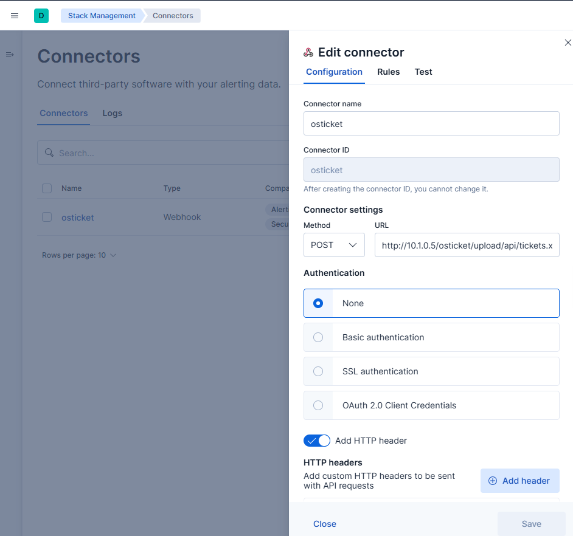
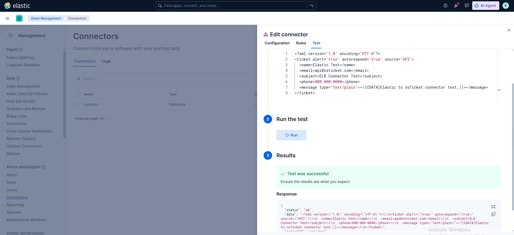

# Automated Ticketing

Elastic Security used a webhook connector to send API ticket-creation requests to osTicket. This demonstrates basic alert-to-ticket automation, not full SOAR orchestration.

## Connector Configuration



The configuration screenshot shows the webhook connector name, POST method, osTicket API URL, and that a custom HTTP header was configured. It does not display or prove the value of the API key.



The connector test completed successfully, proving connectivity at the time of capture.

## API-Created Tickets


The ticket list and individual ticket screenshots prove that API-sourced tickets existed for both custom rule names.


The action body was basic: `Investigate Rule: <rule name>`. It did not include alert fields, host context, source IP, severity, enrichment, assignment logic, retry handling, automatic containment, or closure.

The Windows ticket inherited the historical name `win Rdp brute force`; the ticket does not make the underlying Event ID `4625` rule RDP-specific.

## Exported Artifact

The [sanitized rules and connector NDJSON](../artifacts/detections/custom-rules-and-osticket-connector.sanitized.ndjson) preserves the real connector structure and rule actions. Only the API-key value is redacted.

## Automation Boundary

```text
Elastic Rule Action → Webhook POST → osTicket API → Basic Ticket
```

An analyst still needed to review the corresponding Elastic alert and telemetry. Full case enrichment, response orchestration, and closure automation were not demonstrated.
