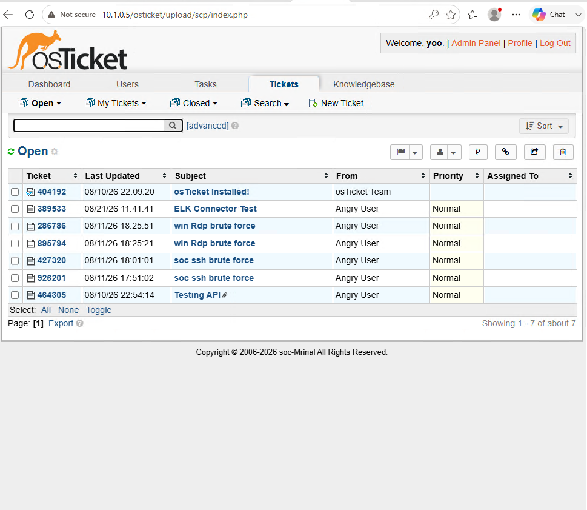
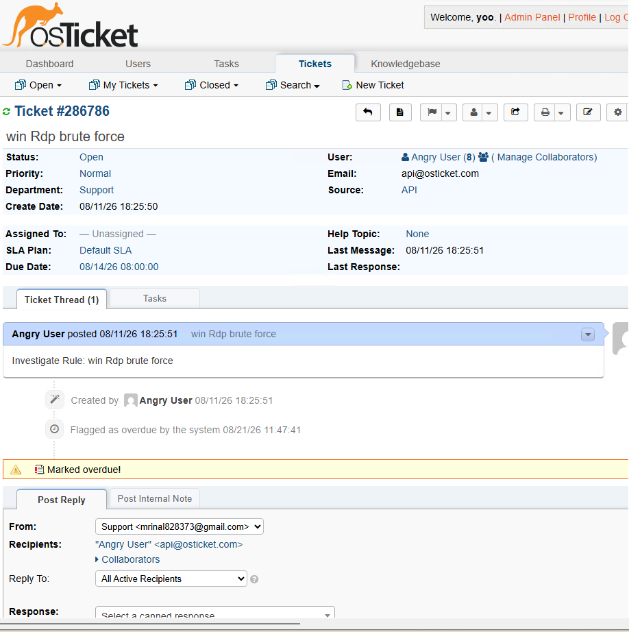
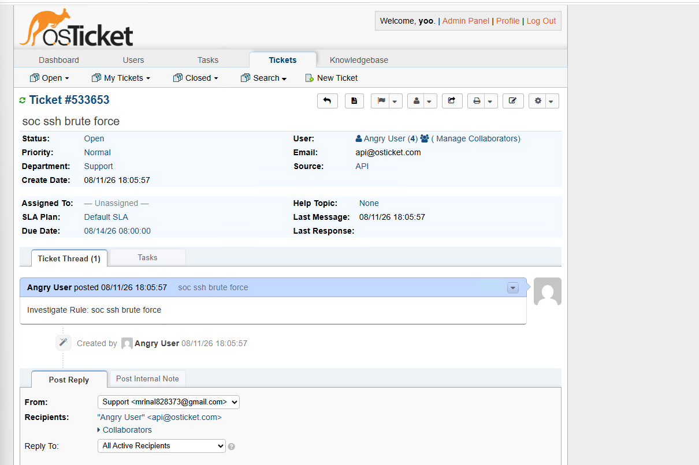

# Automation Evidence

Screenshots documenting the automated alert-to-ticket workflow between Elastic Security and osTicket.

## osTicket Connector Test

Shows the Elastic osTicket connector test completing successfully.

## osTicket Ticket List

Shows security-related tickets present in osTicket, including RDP and SSH brute-force incidents.

## RDP Alert to osTicket

Shows the RDP brute-force alert represented as an osTicket incident created through the API.

## SSH Alert to osTicket

Shows the SSH brute-force alert represented as an osTicket incident created through the API.
