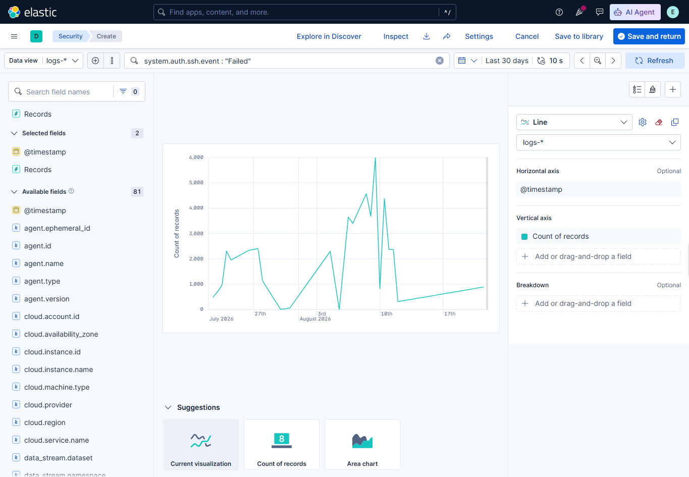
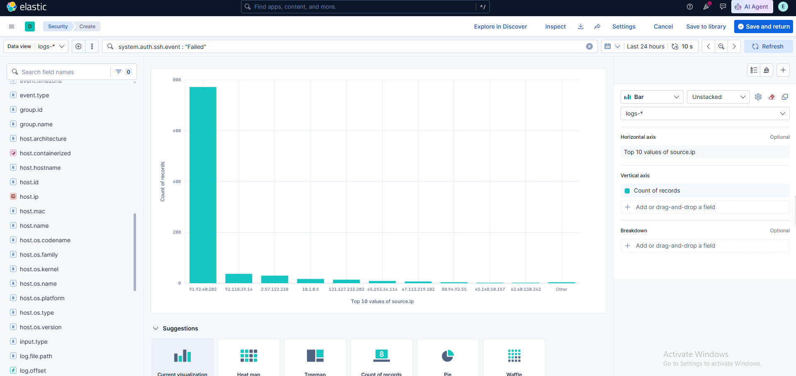

# Security Dashboards

## ELK SOC Monitoring Dashboard

The real Kibana export confirms a dashboard titled `ELK SOC Monitoring Dashboard` using the `logs-*` data view.

## Exported Panels

1. `SSH Authentication Failures Over Time` — line chart querying `system.auth.ssh.event : "Failed"`.
2. `Top SSH Source IPs` — bar chart querying the same failed-SSH events and grouping by the top ten `source.ip` values.

The export does not contain Windows, Defender, detection-alert, or osTicket panels. Its saved-object description is broader than the two panels actually present, so the demonstrated dashboard scope is SSH monitoring.

## Exported Artifact

[Download the real Kibana NDJSON export](../artifacts/dashboards/elk-soc-monitoring-dashboard.ndjson).
