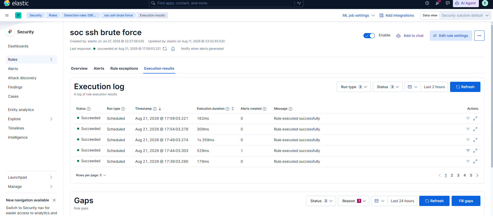
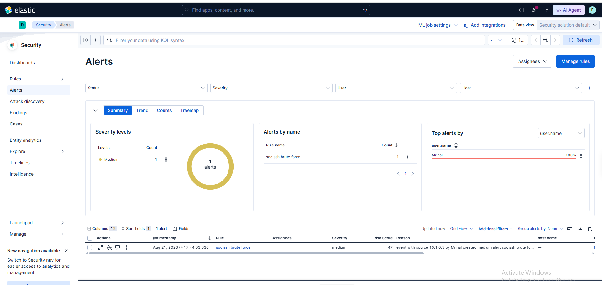
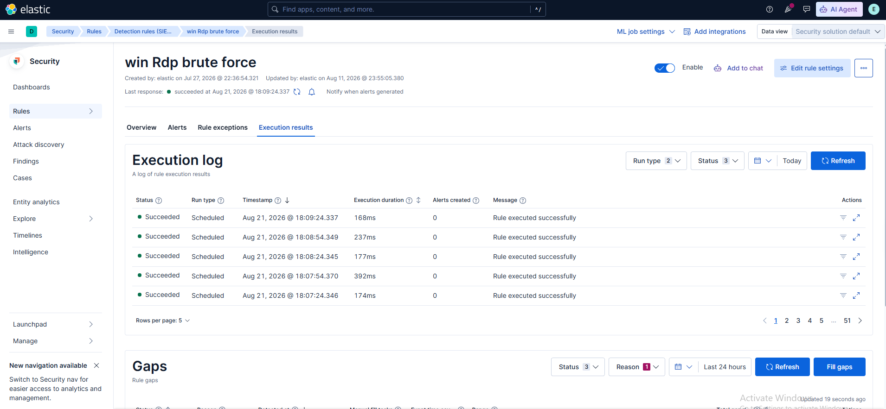
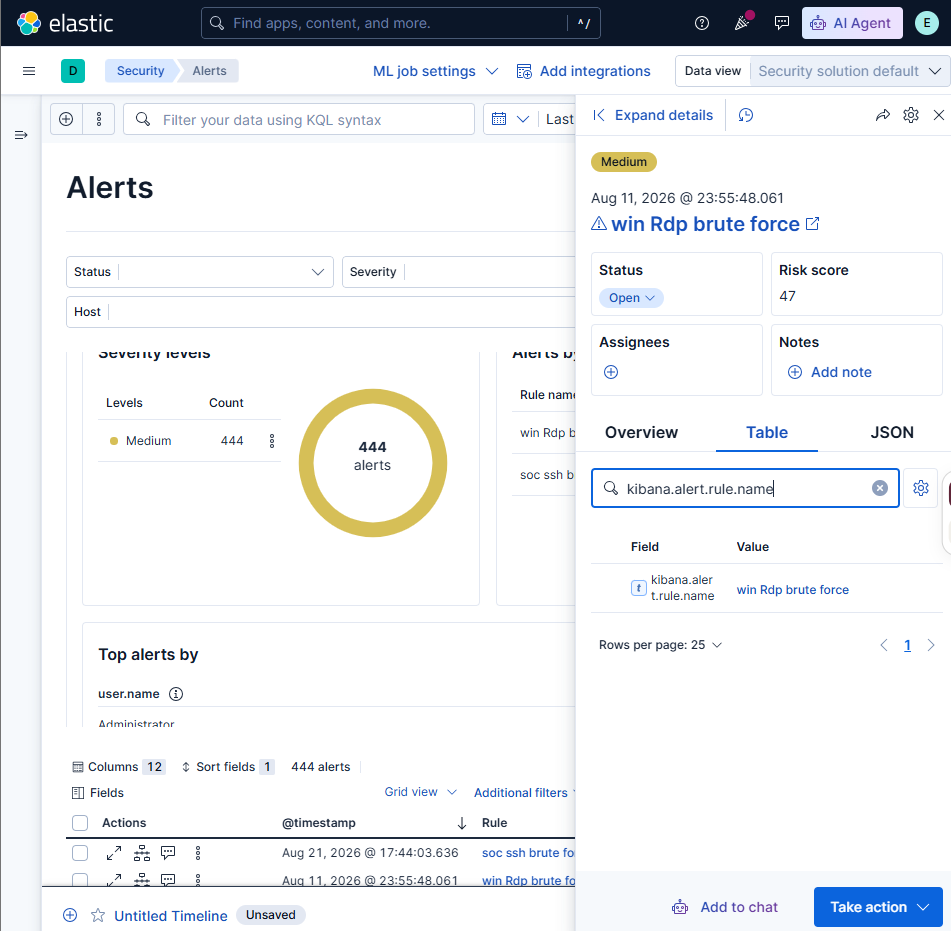

# Detection Engineering

The lab used two custom Elastic Security threshold rules. Their historical names are preserved, but the exported logic—not the name—defines what each rule actually detects.

## SSH Brute-Force Detection

| Field | Exported value |
| --- | --- |
| Rule name | `soc ssh brute force` |
| Query | `system.auth.ssh.event: * and agent.name: ubantu and system.auth.ssh.event: Failed and user.name : Mrinal` |
| Threshold | `5` |
| Grouping | `user.name`, `source.ip` |
| Schedule | Every `5m` |
| Lookback | `now-10m` |



The execution screenshot shows the enabled rule running successfully; the alert screenshot shows a generated alert.



## Windows Failed-Logon Detection

The rule was historically named `win Rdp brute force`, but it was not RDP-specific.

| Field | Exported value |
| --- | --- |
| Historical rule name | `win Rdp brute force` |
| Query | `event.code: 4625 and agent.name: win and user.name: Mrinal` |
| Threshold | `2` |
| Grouping | `source.ip`, `user.name` |
| Schedule | Every `30s` |
| Lookback | `now-330s` |

Event ID `4625` covers failed Windows logons generally. The query did not test Logon Type `10`, so neither the rule name nor its generated alert proves that every match was an RDP failure.





These screenshots prove execution and alert generation for the historically named rule. They do not prove RDP specificity or successful authentication.

## Exported Artifact

The [sanitized rules and connector export](../artifacts/detections/custom-rules-and-osticket-connector.sanitized.ndjson) preserves both historical rule objects and actions. Only the osTicket API-key value was replaced with `REDACTED`.

## Detection Workflow

```text
Endpoint Telemetry → Threshold Rule → Elastic Security Alert
        → Analyst Investigation → Basic osTicket Ticket
```
