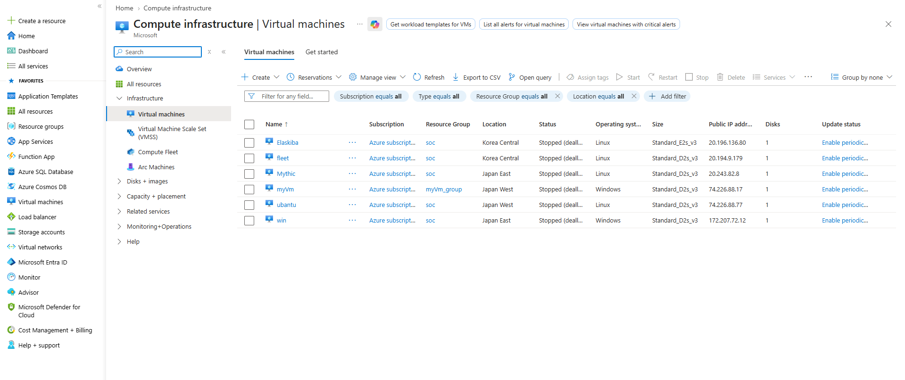
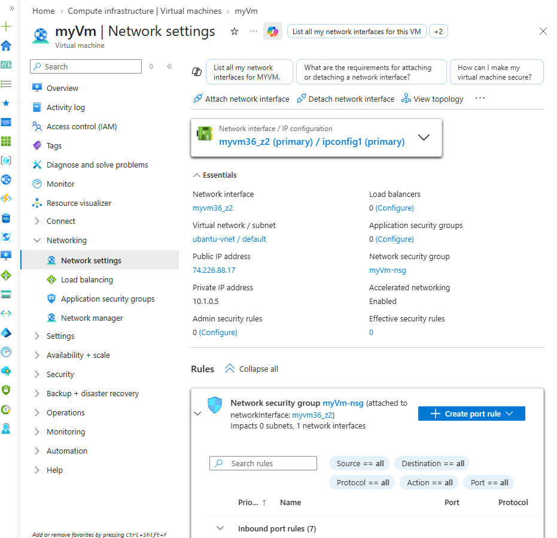
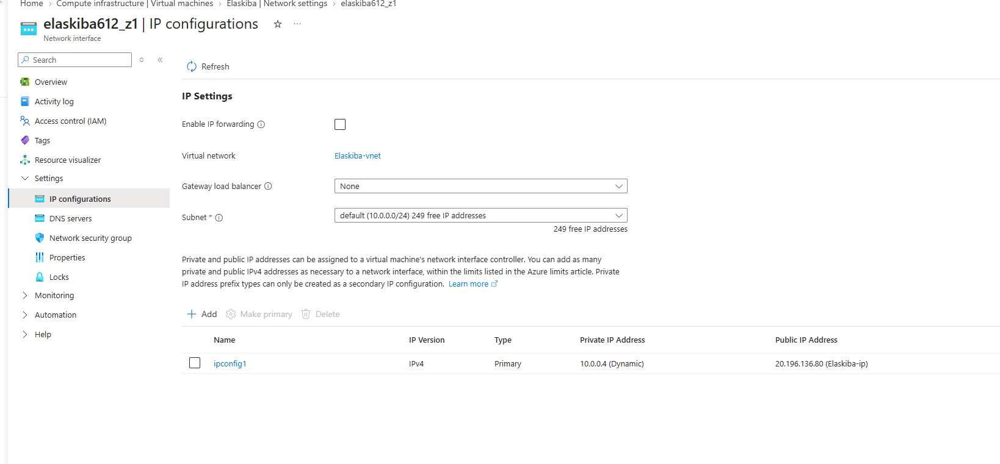

# Lab Environment

The SOC lab was deployed across three Azure Virtual Networks in different regions.

## Virtual Machines

| Component | Private IP | VNet | Region | Role |
|---|---|---|---|---|
| Elaskiba | 10.0.0.4 | elaskiba-vnet | Korea Central | Elasticsearch + Kibana |
| Fleet Server | 10.0.0.5 | elaskiba-vnet | Korea Central | Elastic Fleet / Agent Management |
| Ubuntu | 10.1.0.4 | ubuntu-vnet | Japan West | Linux Log Source |
| myVm | 10.1.0.5 | ubuntu-vnet | Japan West | osTicket / Ticketing |
| win | 10.2.0.4 | win-vnet | Japan East | Windows Log Source |
| Mythic C2 Server | 10.2.0.5 | win-vnet | Japan East | C2 / Attack Simulation |

## Network Architecture

### Hub VNet

**elaskiba-vnet**
- Address space: `10.0.0.0/16`
- Subnet: `10.0.0.0/24`
- Region: Korea Central

### Spoke VNet

**ubuntu-vnet**
- Address space: `10.1.0.0/16`
- Subnet: `10.1.0.0/24`
- Region: Japan West

### Spoke VNet

**win-vnet**
- Address space: `10.2.0.0/16`
- Subnet: `10.2.0.0/24`
- Region: Japan East

## VNet Peering

The hub VNet is peered with both spoke VNets:

elaskiba-vnet
     ├── ubuntu-vnet
     └── win-vnet

## Azure Evidence

### Azure Virtual Machine Inventory

This screenshot shows the Azure virtual machines used in the lab.

### VNet Peerings

This shows the configured VNet peerings between the hub and spoke networks.

### myVm Network Configuration

This shows the private IP and VNet configuration of the myVm ticketing server.

### Elaskiba Network Configuration

This shows the private IP and subnet configuration of the Elaskiba ELK server.
