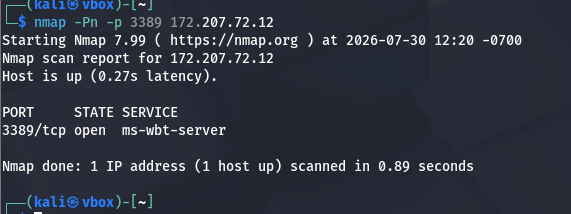
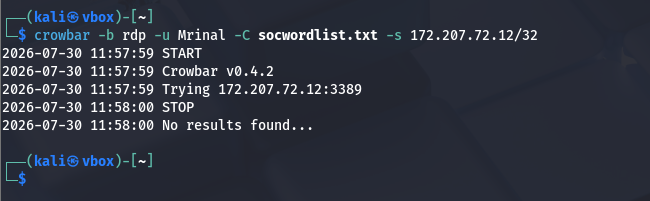
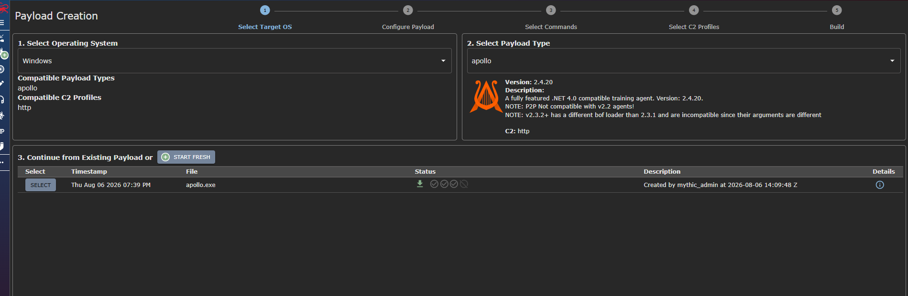
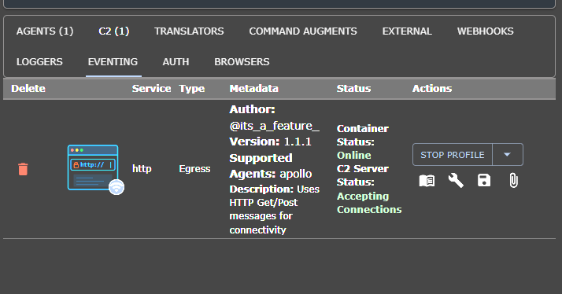
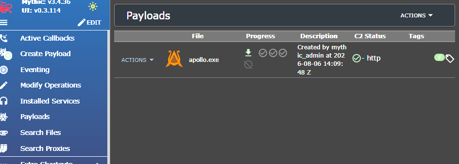

# Attack Simulation Evidence

Screenshots documenting controlled attack-simulation activity used to generate security events for the SOC lab.

## RDP Attack Simulation

### RDP Reconnaissance

Network reconnaissance was performed against the Windows RDP target before the authentication attack.

### RDP Brute-Force Attempt

A Crowbar RDP brute-force attempt was performed against the Windows endpoint. The attempt was unsuccessful and did not establish authenticated access.

## Mythic C2 Simulation

### Mythic Payload Creation

A Windows payload was created in the Mythic C2 platform for controlled attack simulation.

### Mythic C2 Profile

An HTTP-based C2 profile was configured for the attack-simulation environment.

### Mythic Payload

The created payload is shown in the Mythic interface as part of the controlled C2 simulation.
