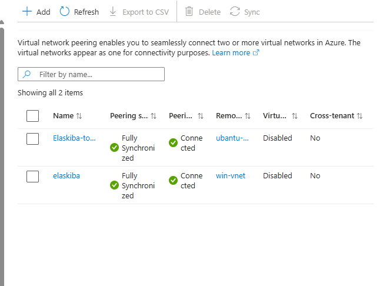

# Azure Infrastructure Evidence

Screenshots documenting the Azure infrastructure used to build the SOC lab.

## Azure Virtual Machine Inventory

Shows the Azure virtual machines used in the lab environment.

## Azure VNet Peerings

Shows the configured VNet peerings between the hub VNet and the spoke VNets.

## myVm Network Configuration

Shows the private IP and VNet configuration of the myVm ticketing server.

## Elaskiba Network Configuration

Shows the private IP and subnet configuration of the Elaskiba ELK server.
