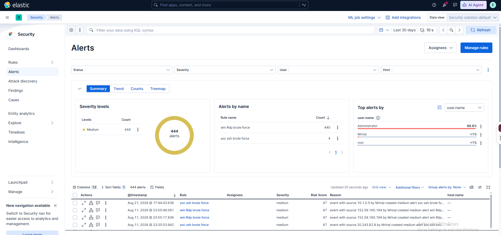
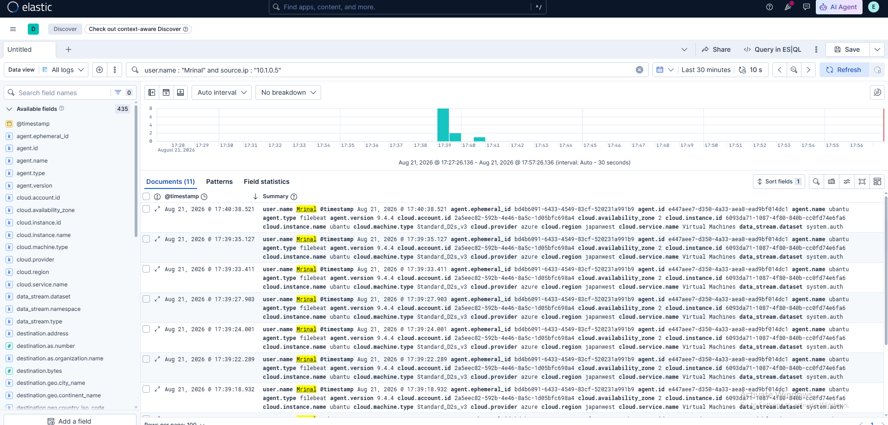

# Detection Evidence

## Rule Overview

The screenshot shows the configured custom rules. Names are historical labels and do not replace inspection of the exported query.

## SSH Rule

These images prove successful execution and alert creation for `soc ssh brute force`.

## Historically Named Windows Rule

The rule was named `win Rdp brute force`, but its export filtered Event ID `4625`, agent `win`, and user `Mrinal` without checking Logon Type `10`. These images prove execution and alert creation, not RDP specificity.

## Alert Volume

The high volume from the historically named Windows rule demonstrates that tuning and suppression work remained.
