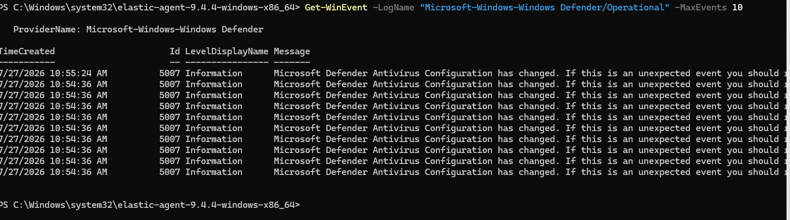

# Telemetry Evidence

Screenshots documenting security telemetry collected from the lab endpoints and forwarded to the Elastic environment.

## Evidence Included

- Elastic Fleet agent enrollment
- Windows telemetry integrations
- Sysmon process creation events
- Windows Defender events
- Ubuntu SSH authentication events

## Elastic Fleet Agent Enrollment

Shows the `win`, `ubuntu`, and `fleet` Elastic Agents in a healthy state.

## Windows Telemetry Integrations

Shows the Windows telemetry integrations configured for the `elasAgent` policy, including `win-defender` and `win-sysmon`.

## Sysmon Process Creation

Shows a Sysmon Event ID 1 process-creation event from the Windows endpoint.

## Windows Defender Events

Shows Windows Defender Event ID 5007 events from the Windows endpoint.

## Ubuntu SSH Authentication Events

Shows failed SSH authentication events collected from the Ubuntu endpoint.
