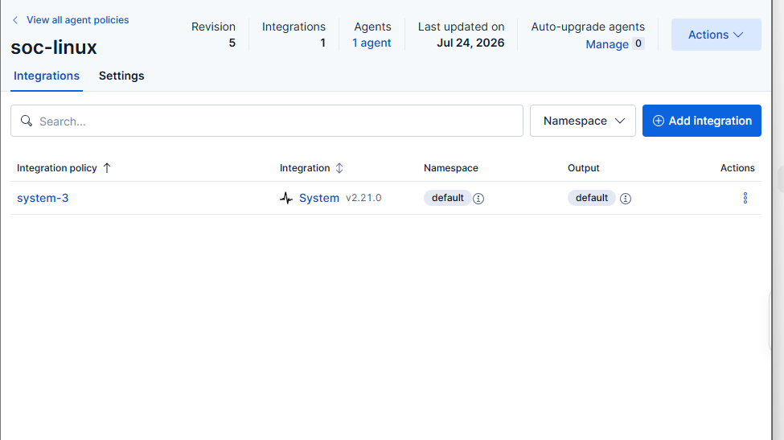

# Telemetry Evidence

## Fleet Enrollment

Shows the `win`, `ubuntu`, and `fleet` agents healthy at capture time only.

## Windows Integrations

Shows Elastic Defend, System, `win-defender`, and `win-sysmon` integrations assigned to the Windows policy.

## Ubuntu Policy

Shows the Ubuntu `soc-linux` policy with the System integration. The applied-policy artifact supplies the exact paths and datasets.

## Sysmon Process Creation

Shows one Sysmon Event ID `1` process-create event. It does not prove complete Sysmon event coverage.

## Windows Defender

Shows Defender Event ID `5007` records searchable in Elastic. This observed-data screenshot is separate from the Fleet export, which configures only `1116`, `1117`, and `5001`.

## Ubuntu SSH

Shows SSH authentication events collected from the Ubuntu endpoint.
