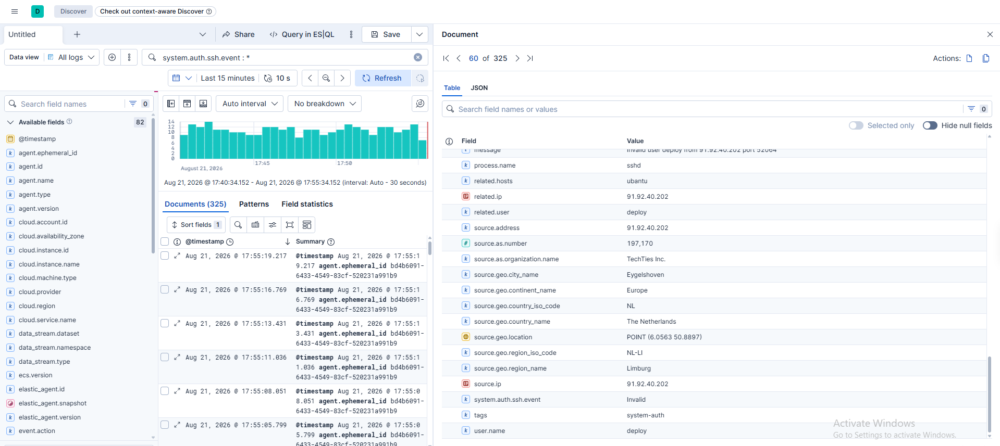
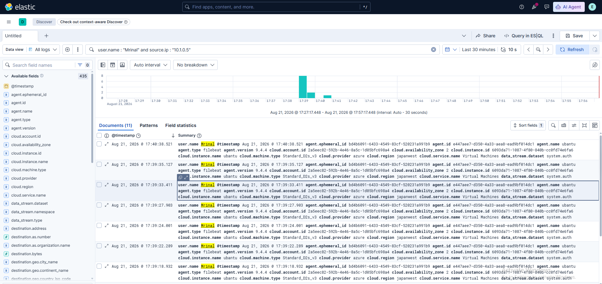
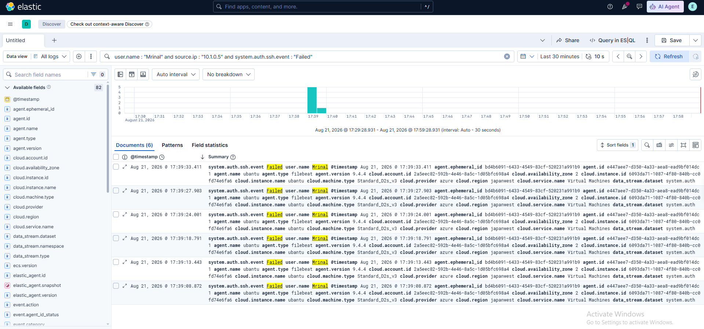

# Security Investigation

This section documents the analyst workflow used to investigate suspicious SSH authentication activity in Elastic Security.

## Event Review

The investigation begins by reviewing the underlying SSH authentication events and examining relevant event fields.



This view shows the details of an individual SSH authentication event, including the user, source IP, process, location, and authentication result.

## User and Source IP Pivot

The investigation can be narrowed by pivoting on the affected username and source IP.



This helps isolate activity associated with a specific user and source.

## Failed Authentication Analysis

The investigation is then narrowed to failed SSH authentication activity to identify repeated unsuccessful attempts.



This view focuses on failed authentication events and provides additional context for determining whether the activity is consistent with brute-force behavior.

## Investigation Workflow

```text
Security Alert / Suspicious Activity
            ↓
Review Underlying Events
            ↓
Examine Event Fields
            ↓
Pivot by User / Source IP
            ↓
Filter Failed Authentication
            ↓
Assess Activity
            ↓
Escalate / Ticket
```
